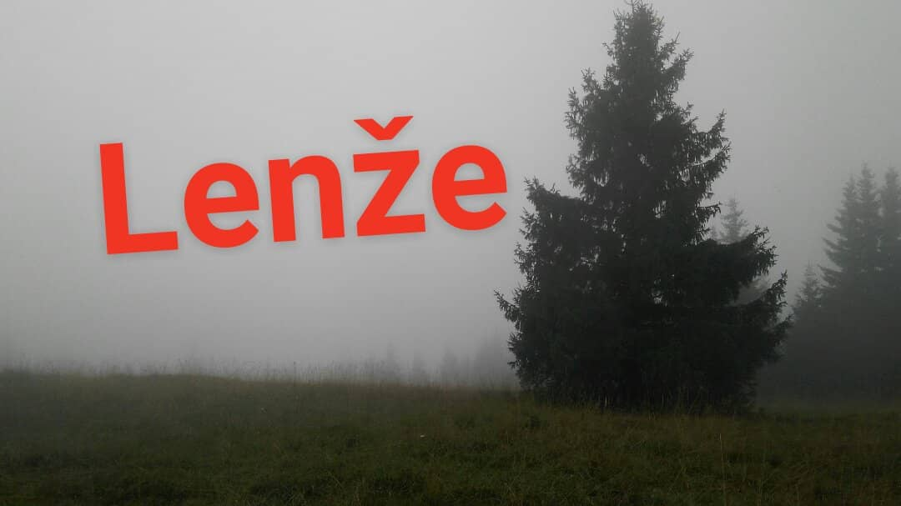


Ako spieva známy ľudový pevec: „Do you have the time to listen to me whine?“. Ak áno tak si zapni pás lebo ideme z kopca.


Milý denníček,
Zobudili sme sa do zamračeného donovalského rána. Nočný dážď pomaly doznieval. Posledné známky piva, whiskey a Ginu som zmyl pohárom čerstvej horskej vody a deň sa mohol začať. Po luxusných raňajkách tvorených čerstvým chlebom priamo z pekárne Donovalského pivovaru, čerstvou Májkou priamo z potravín toť neďaleko a čerstvým oštiepkom priamo z chladničky, sme začali snovať plány na deň. Nakoľko v noci pršalo, nechceli sme ísť na bicykel aby sme neboli zablatení až za ušami. Rozhodli sme sa preto pre krátku pešiu túru. Ani nie túru skôr vychádzku, max. 45 minút tam a 45 späť, k Brankovskému vodopádu.

K samotnému vodopádu to bolo v pohode, pol hodinka po širokom, mierne stúpajúcom chodníku. Samotný vodopád dosť antiklimaktický, najvyšší vodopád v Nízkych Tatrách, lenže v lete je to len mokrá skala, aj to najskôr len vďaka tomu nočnému dažďu (obr. 1). Keďže to k nemu bola slepá odbočka, vrátili sme sa na rázcestie zelenej značky. A vtedy prišla osudová otázka: „Ideme naspäť a na nejaký suchý bicykel alebo ideme ešte na kopec?“ Nemal som chuť na reči o tom aký som lenivý a tak som povedal že je mi to jedno, aj keď sa mi na kopec nechcelo, veď na kopec to bude hore kopcom. Ale boy oh boy, ako trpko som to oľutoval.

„Nenáročná vychádzka.“, hovorili. „Aby sme sa nezablatili.“, hovorili. Zamazaný od blata som bol až za ušami, a dopocený jak po Slížoch v Bernolákove, ak nie aj viac. Nad rázcestím totiž chodník dramaticky zmenil povahu. Namiesto širokého mierne stúpajúceho bol úzky, miestami žiadny, strmý jak sviňa. Kým išiel dolinou, občas aj zdieľal miesto s horskou bystrinkou. Z doliny sa nakoniec zdvihol do úbočia, stúpal ešte prudšie, les striedal lúku. Čo sa však nemenilo bol fakt, že to bolo čisté blato, čiže jeden krok hore a dva dole. Raz normálne si stojím, odpočívam, a zrazu len taký polovičný špagát som vystrúhal jak mi sa mi skĺzla spodná noha, a ďalších pár metrov sa mi to dialo pri každom kroku.

Okrem toho bol, ten chodník, na to aký bol nevýrazný v teréne, ozaj mizerne značený. Aspoň 4 razy sa stalo, že sme zrazu išli mimo neho. Po tomto nekonečnom strastiplnom výstupe sme konečne dorazili na spomínaný kopec. Tričko absolútne prepotené, mokrý som bol takmer ako keď som išiel z Podspádov pešo smer Poľsko. Tričko totálne do nitky (video 1, započúvaj sa), vyždímal som z neho nezanedbateľné množstvo tekutiny, ešteže som zobral aj náhradné. Boli sme teda na vrchole, tak sme si aspoň mohli vychutnať pekný výhľad, všakže? (obr. 2 a 3)

Museli sme sa nejak dostať nazad k autu. Boli dve možnosti: vrátiť sa tade, kade sme prišli alebo ísť ďalej po hrebeni a zísť kus inde. Prvá možnosť bola zlá preto, lebo by sme sa na tom strmom blate asi zabili. Druhá preto, lebo to bolo ďalej, a navyše hrebene majú takú nepríjemnú vlastnosť, že chodia hore-dole. Nakoniec sme zvolili druhú možnosť, napriek tomu že som to už raz oľutoval mi to znova bolo jedno, hlavne dojsť domov a ísť na Zoltána. Kus hrebeňa nezaujímavý až na fakt, že to bol absolútny hovnodrom. Chodník stále úzky, nevýrazný. Aby mi pot z čela netiekol na okuláre, spravil som provizórnu čelenku z rukáva termoprádla. Normálnu čelenku som si nebral, lebo veď len krátka prechádzka. Uzol ma tlačil, ale aspoň som videl.

Fun fact, ešte nás len čakal najvyšší bod. Výstup naň - sodoma gomora. Strmé jak hovädo, navigácia písala 30% sklon (video 2). To sa mi už aj minula voda, ktorej som si zobral pochopiteľne len na krátku vychádzku. Ale vidina oroseného Zoltána ma poháňala vpred. Pod vrcholom už nebol taký strmý, pre zmenu išiel zarezaný v boku kopca. Nie širší ako 20 cm a dole prosto ďúra, normálne som bol vystrašený mladík. Keďže tým chodníkom asi moc ľudí nechodí (chápem ich), boli cezeň popadané stromy. O jeden som si fajne jebol hlavu. Nakoniec ale konečne prišiel vrchol. Tam som chytil 3G a oznámil som ti svoju smrť. Ale veď najvyšší bod za nami, už len dole kopcom, už to bude v pohode.

Tudle. Vieš, strmo dole kopcom, navyše keď je mokro, ergo šmykľavo, to tiež nie je žiadna výhra. Horko ťažko sme zišli do nejakého ďalšieho sedla, kde sme narazili na miestnu faunu (obr. 4). Keďže sme predpokladali že to tam nedoletelo, zamysleli sme sa, či sa odtiaľ nedá dostať jednoduchšie rovno do doliny. Znova bolo rozhodovacie konanie, či ďalej po značke alebo dole. Už mi to nebolo jedno, nechcel som viac ísť do kopca, tak sme sa pustili dole. Síce sme sa práve tam asi najviac zasvinili, ale vyšlo to. Topánky na niektorých miestach blatom oťaželi aj o kilo, ale nakoniec sme sa dostali dole a chytili sme bus späť k autu. Zoltán už je blízko.

Fast-forward na apartmán. Osprchovaný, nedopocený, plný elánu, za chvíľu ideme na večeru. Mohol som ti toto už vtedy napísať, ale vravím si, nebudem predbiehať, možno ešte nejakú facku od života schytám. A sure enough, schytal som. Ideme si objednať v pivovare. „Veľkého Zoltána poprosím.“ „Nemáme, už sa nám minul.“, hovorí čašníčka. A to bola pohroma. Musel som sa uspokojiť s obyčajným Klajmberom (obr. 5), ktorý mi síce pred okoštovaním Zola chutil najviac, no naň som sa celý deň netešil. Do tohoto momentu tento deň sumarizuje obrázok číslo 6. 

Na jedzeňje som dal burger, bol svetový, ani som ho odfotiť nestihol lebo som bol hladný ako vlk ( https://youtu.be/yxNw1bgH4dQ ), išli sme sa ešte trocha prejsť a keďže cestou späť sa nám do cesty postavil sviňa pivovar, dal som ešte jednu Winter ipu (obr. 7), dobrá bola. A život si pre mňa ešte stále nechal jednu maličkú facočku, keď som teraz počas písania tejto poviedky zabudol vypiť svoju whisku. Takže nazdravie.

Túto fotoreportáž vám priniesli: NaPaNT, Donovalský pivovar a Jameson.

Tak. To sa meinen Meinung nach dá považovať za solídny rock-block môjho dňa. Obrázky budú hneď.
